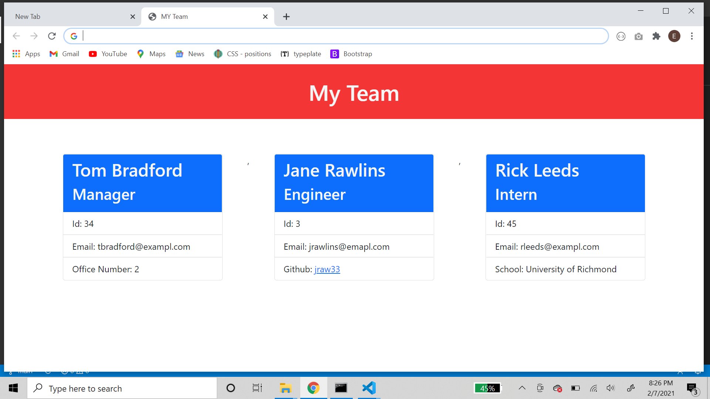
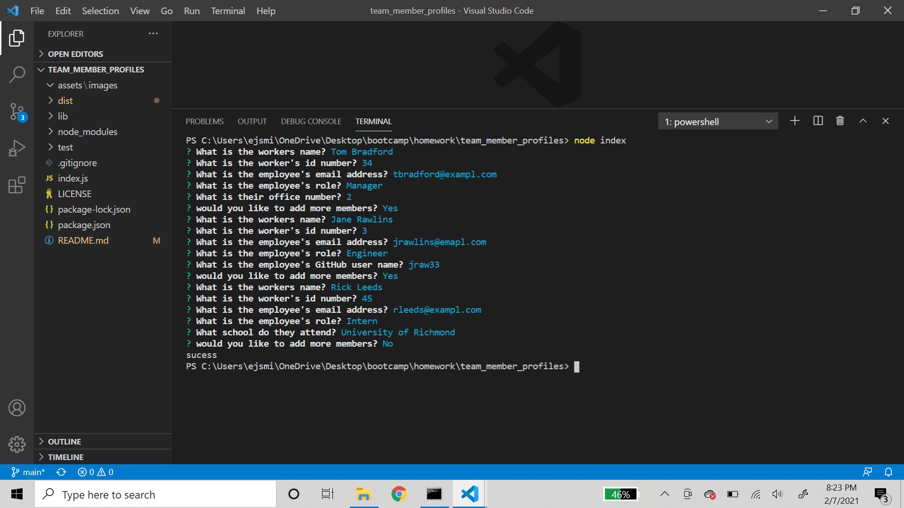

# Team Member Profile Generator

  

  ## Table of Contents

  * [Description](#description)

  * [Screenshots](#screenshots)

  * [Installation](#installation)

  * [Tests](#tests)

  * [Usage](#usage)
  * [Contributing](#contributing)

  * [Technologies](#technologies)

  * [Questions](#questions)

  * [License](#license)

  
--------------------------------------

  ## Description:

  This is a command line interface app that allows the user to dynamically create an HTML page that displays all the members of an entered team. The user can enter managers, engineers, or interns along with the pertaining information for each job. The app then creates file cards for each person entered and puts deploys it to an html document.

  
--------------------------------------

## Screenshots:

  
  

  
--------------------------------------

  ## Installation

  To install the necessary dependencies use the following command:
  
      npm i
  
  
--------------------------------------

  ## Tests

  To run tests use the following command:
  
      npm run test
  
  
--------------------------------------

  ## Usage:

  Feel free to use this project

  
--------------------------------------

  ## Contributing:

  Contributions are welcome. Please follow best practices put forth by github

  
--------------------------------------

 
  ## Technologies Used
  For this project I used:

   HTML, CSS, JavaScript, Bootstrap

  
  
--------------------------------------

  ## Questions

  My name is Ethan Smith if you have questions about this project, please visit my github account (linked below) or feel free to send me an email.

  GitHub account: https://github.com/ejsmith13

  Email: ejsmithwork@gmail.com

  
--------------------------------------

  ## License

  https://opensource.org/licenses/MIT

  Copyright (c) 2021 Ethan Smith

      Permission is hereby granted, free of charge, to any person obtaining a copy
      of this software and associated documentation files (the "Software"), to deal
      in the Software without restriction, including without limitation the rights
      to use, copy, modify, merge, publish, distribute, sublicense, and/or sell
      copies of the Software, and to permit persons to whom the Software is
      furnished to do so, subject to the following conditions:
      
      The above copyright notice and this permission notice shall be included in all
      copies or substantial portions of the Software.
      
      THE SOFTWARE IS PROVIDED "AS IS", WITHOUT WARRANTY OF ANY KIND, EXPRESS OR
      IMPLIED, INCLUDING BUT NOT LIMITED TO THE WARRANTIES OF MERCHANTABILITY,
      FITNESS FOR A PARTICULAR PURPOSE AND NONINFRINGEMENT. IN NO EVENT SHALL THE
      AUTHORS OR COPYRIGHT HOLDERS BE LIABLE FOR ANY CLAIM, DAMAGES OR OTHER
      LIABILITY, WHETHER IN AN ACTION OF CONTRACT, TORT OR OTHERWISE, ARISING FROM,
      OUT OF OR IN CONNECTION WITH THE SOFTWARE OR THE USE OR OTHER DEALINGS IN THE
      SOFTWARE.
